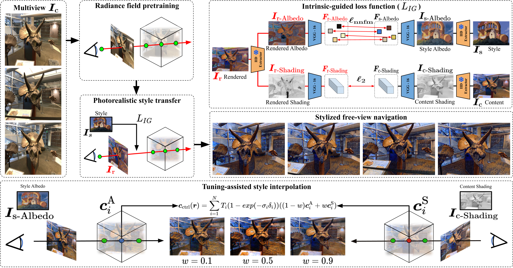

# Intrinsic-Guided Photorealistic Style Transfer for Radiance Fields
---
[](https://oshmos.github.io/IPRF)
[](https://drive.google.com/file/d/10vp2SWByAJGr-Ccrw68c2hTepsMr5di9/view?usp=sharing)
<!-- [](https://dl.acm.org/doi/10.1145/12345) -->
[](https://mm2025-app3dv-workshop.github.io/)



## Contributions

- We propose IPRF, a novel photorealistic 3D style transfer framework that leverages Intrinsic Image Decomposition (IID) to move beyond simple color-based transformations while preserving structural consistency.

- IPRF preserves the physical realism of content by independently optimizing albedo and shading losses, enabling faithful separation of material and illumination properties.

- We introduce TSI (Tuning-assisted Style Interpolation), a real-time method that enables smooth style transitions and efficient hyperparameter exploration without requiring additional training.

- Extensive benchmarks demonstrate that IPRF outperforms
prior methods in balancing photorealism and style fidelity.

## Getting Started
### Environment Requirement

Clone the repo:

```bash
git clone https://github.com/OSHMOS/IPRF.git
cd IPRF
```

Install the iprf requirements using `conda` and `pip`:
```bash
conda create -n iprf python=3.9 -y && conda activate iprf
pip install -r requirements.txt
pip install -e . --verbose
```

### Input Data Preparation
IPRF supports datasets like ```NeRF-LLFF``` and ```ARF-Style``` data.
To quickly test the method, download a sample dataset:

``` bash
# Place the downloaded data in ```IPRF/data/```.
mkdir data && cd data
gdown 1VNaB0Wy1almoXEq44ipw83SERDHMozQB
unzip data.zip && cd ..
```

### PIE-Net (Intrinsic Image Decomposition Extractor)

[PIE-Net](https://ivi.fnwi.uva.nl/cv/pienet/assets/PIE_NET_CVPR_2022_main_paper.pdf) for Intrinsic Image Decomposition

Download the [Pre-trained PIE-Net](https://uvaauas.figshare.com/articles/conference_contribution/real_world_model_t7/19940000)
Place the downloaded model in 
```IPRF/opt/iid_extractor/ckpt/<pre-trained model>``` and 
```IPRF/controllable/iid_extractor/ckpt/<pre-trained model>```

## Test
### For accurate reproduction, we recommend GeForce RTX 4090 or higher GPU.

We basically require two GPUs: one for Intrinsic Image Decomposition (24GB VRAM is required) and one for Style Transfer (8GB VRAM is sufficient). If using a single GPU, 32GB VRAM is required.

### Style Transfer

Stylize the flower scene:
```bash
#. ./try_llff.sh [scene_name] [style_number]
. ./ try_llff.sh flower 14
```

### 3D Style Interpolation

For interpolating between albedo and shading, use gradio :
```bash
cd IPRF/controllable/
python 3D.py
```

## Citation
### Coming Soon!
<!-- ```
@article{OH2025,
    title = {Accurate baseball player pose refinement using motion prior guidance},
    journal = {ICT Express},
    year = {2025},
    issn = {2405-9595},
    doi = {https://doi.org/10.1016/j.icte.2025.03.008},
    url = {https://www.sciencedirect.com/science/article/pii/S2405959525000360},
    author = {Seunghyun Oh and Heewon Kim},
    keywords = {Human pose estimation, Human pose refinement, Deep learning}
}
``` -->

## Acknowledgement

We would like to thank the authors of [Plenoxel](https://github.com/sxyu/svox2.git), [ARF-svox2](https://github.com/Kai-46/ARF-svox2.git) and [PIE-Net](https://github.com/Morpheus3000/PIE-Net.git) for open-sourcing their implementations.
